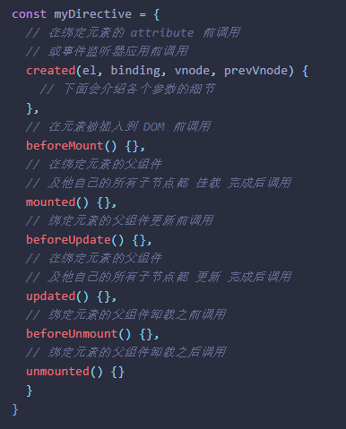

> **全篇为组合式**

# 介绍 [🔗](https://staging-cn.vuejs.org/guide/introduction.html#api-styles)

- **选项式 API**

  1. 定义的属性都会暴露在函数内部的 `this`(指向当前的组件实例) 上
  2. 是基于 组合式 API 实现的另一种形式

- **组合式 API**  [setup](https://staging-cn.vuejs.org/api/sfc-script-setup.html)

  1. 视图层可直接获取逻辑层对象

  2. ```vue
     <script setup></script>
     /* OR 选项式*/
     <script>
     export default { setup() {return {/*暴露对象*/} }//通过this访问setup暴露的对象
     </script>
     ```

  3. 更好的兼容TS

  4. 完美取代`mixin`。

# 响应式

- `reactive()`**默认是深层响应式**(深代理);

- 浅响应使用 `shallowReactive()`

- 当你更改响应式状态后，DOM 也会自动更新. 

  (在更新周期的 “下个时机” 以确保无论你进行了多少次声明更改，每个组件都只需要更新一次。)

- `nextTick(func)`更新后的dom;

```js
import { reactive } from 'vue'
const state = reactive({ ... })//reactive() 返回一个原始对象的 Proxy
```

 `reactive()` [的局限性](https://staging-cn.vuejs.org/guide/essentials/reactivity-fundamentals.html#limitations-of-reactive)

**`ref()` 定义响应式变量**

- `ref()` 使我们能创造一种**任意值的 “引用”** 并能够不丢失响应性地随意传递
-  ref 在作为组件模板顶层 property 被访问时，它们会被自动“解包(解构)”
- 在深层响应式对象内时，会发生 ref 解包;

```js
import { ref } from 'vue'
const count = ref(0);//{ value: 0 }
count.value = { xx: 0 };//{ value: { xx: 0 } }
```

- 响应性语法糖 `$ref()`
  1. 无需手动添加value
  2. **处于实验性阶段**

------

> TIP

- reactive()入参一个代理会返回它自己(直接返回)

# 格式

- 开头
  1. `v` - 自定义指令
  2. `on` - 多数为生命周期钩子

# 自定义指令

```vue
<script setup>
// 在模板中注册 v-focus
const vFocus = {
    //el当前元素
  mounted: (el) => el.focus()
}
//OR
export default {
  directives: {
    // 在模板中启用 v-focus
    focus
  }
}
</script>
```

## [指令钩子](https://staging-cn.vuejs.org/guide/reusability/custom-directives.html#directive-hooks)



### [钩子参数](https://staging-cn.vuejs.org/guide/reusability/custom-directives.html#hook-arguments)

> 除了 `el` 外，你应该将这些参数都视为只读的。若你需要在不同的钩子间共享信息，推荐方法是通过元素的 [dataset](https://developer.mozilla.org/en-US/docs/Web/API/HTMLElement/dataset) attribute。
>

> TIP

- 

**`简化形式`**

```js
//v-xxx 
// 这会在 `mounted` 和 `updated` 时都调用
app.directive('xxx', (/* 钩子参数 */) => {})
```

# el

```js
vnode.data.on.<someEvent>.apply(vnode.context,[参数...]);//触发并代理
el.event.appear.handler = () => {//修改代理
    vnode._vei.onAppear();//触发事件//vue3
    vnode.data.on.appear();//触发事件//vue2
}
```

------

> TIP

- 当所需功能只能通过直接 DOM 操作来实现时，才应该使用自定义指令。
- 自定义指令的参数也可以是动态的`v-example:[arg]="value"`
- 组件上使用自定义指令时，它会始终应用于组件的根节点

# [插件](https://staging-cn.vuejs.org/guide/reusability/plugins.html#introduction)

- use()必须提供 `install` 方法
- 该方法需要在调用 `new Vue()` 之前被调用。

```js
import { createApp } from 'vue'
const app = createApp({})
const Plugin = {
    install(app, options){}
}
app.use(Plugin, options)//options 对应上面的 options
```

# 路由

- [简单路由示例](https://staging-cn.vuejs.org/guide/scaling-up/routing.html#simple-routing-from-scratch)

# [异步组件](https://staging-cn.vuejs.org/guide/components/async.html#async-components)

- 拆分应用为更小的块，并仅在需要时再从服务器加载相关组件

# $refs

- 视图渲染后赋值

```js
let content = ref<HTMLElement | null>(null);
//<div ref="content" />
```

