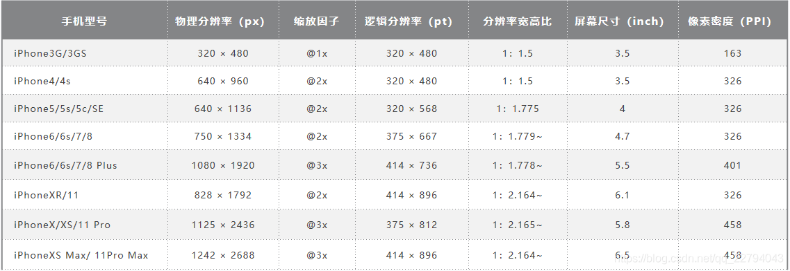
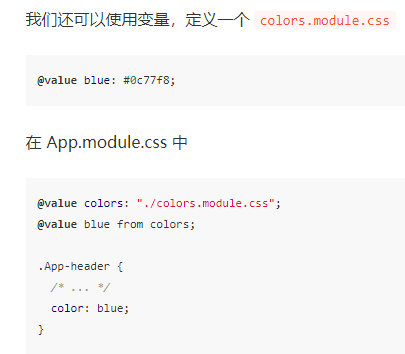

# 插槽

- https://developer.mozilla.org/en-US/docs/Web/HTML/Element/slot

# 裁剪

background: 
linear-gradient(135deg, transparent 5px, #1e1e1e 0) top left,
linear-gradient(135deg, transparent 5px, #1e1e1e 0) top left;

# 固定

```css
position: fixed;
bottom: 0;
```

# [inert “惰性”](https://mp.weixin.qq.com/s/mGUF7ZHbPV11fCDmuzO5Fw)

`<Element inert />`**用户对该节点的任何操作**表现为好像该节点不存(如: 页面查找,点击,焦点, 输入,...)

# 渲染优化

> content-visibility: auto;

- `visible` - 默认
- `hidden` - (不渲染)类似于对其内容设置了display: none属性。
- `auto` - 可见区域的元素，会正常渲染其内容
  1. 如果父元素高度是跟随内容高度, 应给父元素固定高(防止回收频闪)

> contains-intrinsic-size：312px;

1. 初始占位高度
1. 其实没有直接设置height好使

> will-change: opacity;

- `opacity`

1. 开启 [GPU](https://cloud.tencent.com/product/gpu?from=10680) 加速，能让动画变得更流畅

2. 有节制的使用，当元素变化之前和变化之后，通过脚本切换 will-change 的值，并在动画完成后，将元素的 will-change 删除。

3. 滥用会降低性能

> scroll-behavior: smooth;

- auto： 滚动框立即滚动
- smooth： 通过定义事件函数来实现平稳滚动


# 粘性

```css
	top: 0px;
	position: sticky !important;
```

# 滚动

- 滚动条自定义

  - 更多详细参考:

    https://segmentfault.com/a/1190000003708894

    https://zhuanlan.zhihu.com/p/382066094

```css
overflow: auto; //溢出时: auto自动 | hidden隐藏
overflow-y:hidden;

scroll-behavior: smooth;//平滑滚动
```

- 滚动至元素`<element>.scrollIntoView()`


| *h-shadow* | 必需的。水平阴影的位置。允许负值                             |
| ---------- | ------------------------------------------------------------ |
| *v-shadow* | 必需的。垂直阴影的位置。允许负值                             |
| *blur*     | 可选。模糊距离                                               |
| *spread*   | 可选。阴影的大小                                             |
| *color*    | 可选。阴影的颜色。在[CSS颜色值](https://www.runoob.com/cssref/css_colors_legal.aspx)寻找颜色值的完整列表 |
| inset      | 可选。从外层的阴影（开始时）改变阴影内侧阴影                 |

# 文字

####   文字渐变

```css
    //文字渐变
    display: inline-block;
    background: linear-gradient(0.2turn, #ffffff, #ffc500);
    background-clip: text;
    -webkit-background-clip: text;
    color: transparent;

    font-size: 2em;
    font-weight: 700;
```

#### 排列

```css
 /*文本垂直居中*/
line-height: ;
text-align: center;
/* left|center|right */

/* 或直接flex布局 */
/*元素内元素 分散对齐*/
text-align-last:justify;
text-align:justify;
/*换行*/
flex-wrap: wrap;
word-wrap:break-word;
https://www.runoob.com/w3cnote/css-nowrap-break-word.html
```

#### 文字阴影

text-shadow: 0px 0px 0px #0000ff;

# 加载字体

```css
@font-face {
	/*定义引入字体包的名称*/
    font-family: 'mFontRegular';
    src:url('字体包资源路径');
}
.name{
    /*使用*/
    font-family: mFontRegular;
  }
```

# 效果处理

`opacity`:  1;

1. 透明度

`filter`

- brightness(300%); //图片亮度

# 镜像 和 旋转

```css
transform: rotateY(180deg);   /* 水平镜像翻转 */
transform: rotateX(180deg);   /* 垂直镜像翻转 */

transform: rotate(-180deg); /* 旋转 */
transform-origin: center center;/* 旋转点 + 固定定位 */
```

> [transform](https://www.runoob.com/cssref/css3-pr-transform.html)
> 通过`transform-style: preserve-3d;`转3d空间 再`transform`控制角度  - **视觉**
> transform: scale(0.5); - 缩放

# 伪3d

```css
/* 转3d空间并控制xy轴 */
transform-style: preserve-3d;
/* -30x,0y ; 负正y左右 */
/* x,0y ;正负x上下*/
--x: 0deg;
--y: 0deg;
transform: rotateX(var(--x)) rotateY(var(--y)) rotateZ(0deg);
/*过渡*/
transition: all 0.1s;
/*子元素使用*/ /* Z - 轴偏移 */
transform: translateZ(40px);
```

> `transform-style: preserve-3d;`  - 保留3d轴
> `rotate` - X,Y,Z deg
> `translate` - X,Y,Z偏移

# -内联样式

`<html lang="en" style="--rect-width: 5px;">`

# --控制样式--

[:root{};	var();	calc();](https://www.cnblogs.com/WQLong/p/7792174.html)

​	-- 详细[**calc()**](https://www.runoob.com/cssref/func-calc.html)

​	`document.querySelector(':root').style.setProperty('被更改的css变量', '更改属性值');`

读取当前**正在显示**的样式：
		`元素.currentStyle.样式名`--IE
		`元素.getComputedStyle(m, null).样式名`--其他浏览器
		`window.getComputedStyle(element, null).getPropertyValue("属性")`

​		`window.getComputedStyle(element, null).height`

​		`<element>.offsetLeft`据定位的父级距离

```
window.getComputedStyle(element, pseudoElement)  
```

> getComputedStyle(root).getPropertyValue(变量) - 获取root变量

**参数说明：**

- element: 必需，要获取样式的元素。
- pseudoElement: 可选，伪类元素，当不查询伪类元素的时候可以忽略或者传入 null。

# [光标](http://www.divcss5.com/rumen/r427.shtml)

cursor:
	default			默认正常鼠标指针
	hand | text 	文本选择效果
	move 			  移动选择效果
	pointer  		  手指形状 链接选择效果
	url(url) 		    设置对象为图片


# [内嵌网页](https://blog.csdn.net/qq_40697172/article/details/106865583) 优化

`<iframe src="url" width="100%" allowfullscreen frameborder="0"></iframe>`

```css
自适应内嵌网页高度
iframe {    
display: block;
border: none;
/*设置高度百分比,一直调到只有一个滚动调为止*/
height: 90vh;
width: 100%;
}
```

# 一些伪类

```css
:is(h1,h2)> b	等于h1>h2>b
a:link			未访问时的状态（鼠标点击前显示的状态）
a:hover 		鼠标悬停时的状态
a:visited		已访问过的状态（鼠标点击后的状态）
a:active		鼠标点击时的状态
a:focus 		点击后鼠标移开保持鼠标点击时的状态[获得焦点]（只有在<a href="##"></a>时标签中有效）
```

> a标签可以夹杂其他标签使用上面伪类

# [css选择器](https://developer.mozilla.org/zh-CN/docs/Web/CSS/CSS_Selectors)

" + "相邻兄弟 	- **指定元素 的下一个** 
" ~ "兄弟选择器 - **指定元素的 后面的所有兄弟结点**
" > "子选择器

" :first-child "		 - **指定元素是它的父级的第一个子元素** - last-child 
" :nth-child(n) " 	- **(n)第几个子元素**
" :nth-of-type(n) " -**(n)指定类型第几个元素**
" :not(选择器) " 	  -**反选**
"[:scope](https://developer.mozilla.org/zh-CN/docs/Web/CSS/:scope)" 					-配合js选择器使用

属性选择器: [class = "xx"]{ }//`<div class="xx"></div>`

# [display: flex;](https://www.ruanyifeng.com/blog/2015/07/flex-grammar.html)

设为 Flex 布局以后，子元素的`float`、`clear`和`vertical-align`属性将失效。


## 容器(父元素)的属性 :

- flex-direction: <主轴方向> `nvue`

  ```css
  row（默认值）：主轴为水平方向，起点在左端。
  row-reverse：主轴为水平方向，起点在右端。
  column：主轴为垂直方向，起点在上沿。
  column-reverse：主轴为垂直方向，起点在下沿。
  ```

- flex-wrap: <如何换行> `nvue`

  ```css
  nowrap（默认）：不换行。
  wrap：换行，第一行在上方。
  wrap-reverse：换行，第一行在下方。
  ```

- flex-flow: `<flex-direction>  <flex-wrap>`

- justify-content: <项目在 主轴上 的对齐方式> `nvue`

  ```css
  flex-start（默认值）：左对齐
  flex-end：右对齐
  center： 居中
  space-between：两端对齐，项目之间的间隔都相等(最外层无间隙)。
  space-around：分散对齐(项目间距比边框大一倍)。
  space-evenly: 分散对齐(间距相等)* //no-nvue
  ```

- align-items: <项目在 叉轴上 的对齐方式> `nvue`

  ```css
  flex-start：交叉轴的起点对齐。
  flex-end：交叉轴的终点对齐。
  center：交叉轴的中点对齐。
  baseline: 项目的第一行文字的底部基线对齐。//no-nvue
  stretch（默认值）：如果项目未设置高度或设为auto，将占满整个容器的高度。
  ```

- align-content: <多根轴线的对齐方式> 

  ```css
  flex-start：与交叉轴的 起点 对齐。
  flex-end：与交叉轴的 终点 对齐。
  center：与交叉轴的 中间 对齐。 
  space-between：与交叉轴 左右两端对齐 ，轴线之间的间隔平均分布(最外层无隙)。
  space-around：每根轴线两侧的间隔都相等。所以，轴线之间的间隔比轴线与边框的间隔大一倍。
  stretch（默认值）：轴线占满整个交叉轴。
  ```

## 项目(子元素)的属性

- order: <属性定义项目的int `排列顺序`。数值越小，排列越靠前，默认为0。

- flex-grow: < `放大比例`，默认为0，即如果`存在剩余空间，也不放大`。`设置为1时存在剩余空间，将放大`>

- flex-shrink: < `缩小比例`，默认为1，即如果`空间不足，该项目将缩小`。`设置为0时,空间不足时不缩小`>

- flex-basis: <`分配多余主轴空间`（main size）>

- flex: none | auto | <'flex-grow'   'flex-shrink'   'flex-basis'   'align-content'> 

  ```
  快捷值：auto (1 1 auto) 和 none (0 0 auto)。
  三个值: flex-grow flex-shrink flex-basis
  ```
  
- align-self: <单个项目有与其他项目不一样的对齐方式>  

  ```css
  /* 可覆盖align-items属性。默认值为auto表示继承父元素的align-items属性，如果没有父元素，则等同于 stretch */
  align-self: auto | flex-start | flex-end | center | baseline | stretch;
  ```
  
  > **xx-self: ;**

# position

relative; //相对定位-作为子元素参照物
position: absolute; //绝对定位-根据参照物移动
position:fixed; // 固定定位
position: sticky; //粘性布局 //可用于吸附效果

# js 批量设置style

```js
    obj.style.cssText = `
    position: fixed;
    display: none;
    z-index: 99999;
    cursor: pointer;
    `;
```

# 动画

**[animate](https://developer.mozilla.org/zh-CN/docs/Web/API/Element/animate)**

# --分辨率--

```html
<style type="text/css">
    //max小于等于时；min大于等于时
    /*超小屏幕下*/
    @media screen and (max-width: 767px) {.container{width: 100%}}
    /*小屏幕下*/
    @media screen and (min-width: 768px) {.container{width: 750px}}
    /*中屏幕下*/
    @media screen and (min-width: 992px) {.container{width: 970px}}
    /*大屏幕下*/
    @media screen and (min-width: 1200px) {.container{width: 1170px}}
    
    @media (height > 600px) {}
    @media (400px <= width <= 700px) {}
</style>
///JS
window.matchMedia("(min-width: 1200px)").matches//返回类型bool；
```




# 边框

```css
//控制边框各种
.border:before{
	content: '';
	height: 20px;
	width: 4rpx;
	margin-top: 20rpx;
	padding-bottom: 20rpx;
	background-color: #d3d3d3;
}
```

# --CSS Modules--

- https://juejin.cn/post/6992428132263264264#heading-3

  

# [--SCSS--](https://www.runoob.com/sass/sass-functions.html)

`编译时多态`

- scss

```scss
//都可全局或局部
//变量 定义 修改 使用
$xx: any;
//导入
@import 'path';
//定义混入
@mixin name($w:10) {w: $w;}
//使用混入
@include name(20);
//继承
@extend class;
//插值 如:.#{$xx}{}
#{$class}
//颜色混合
mix()
```

- js

```scss
//scss导出对象
:export { xx: $xx; }
//js导入对象
import from
```
